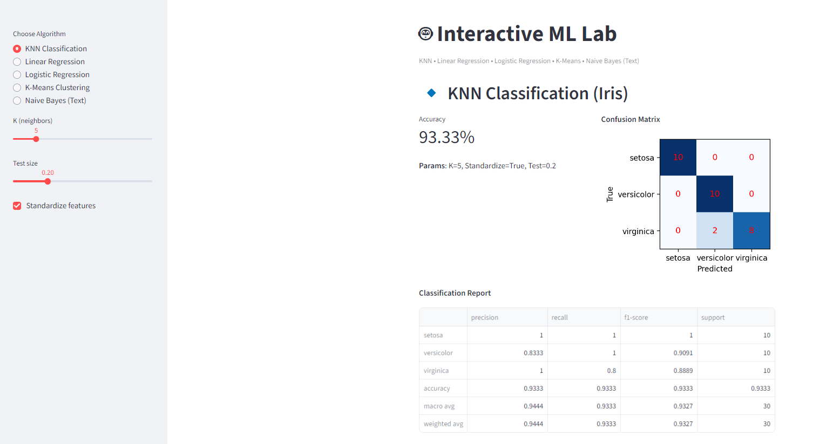
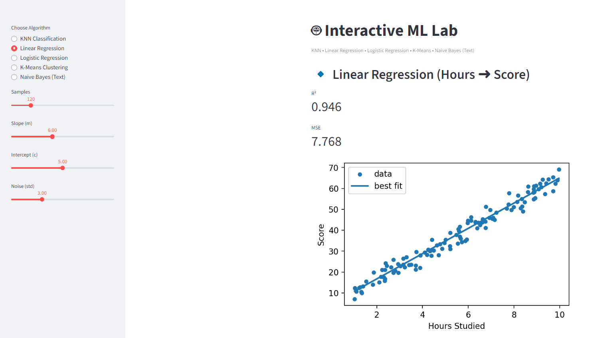
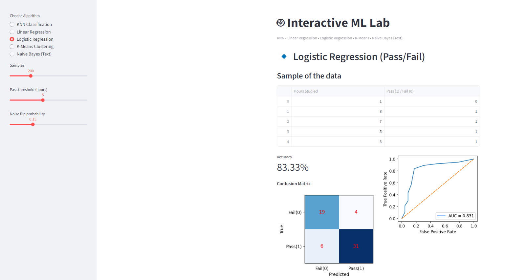
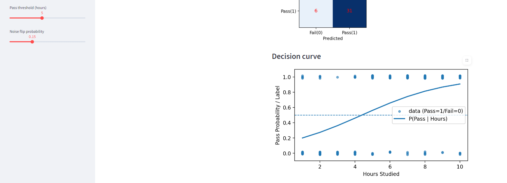
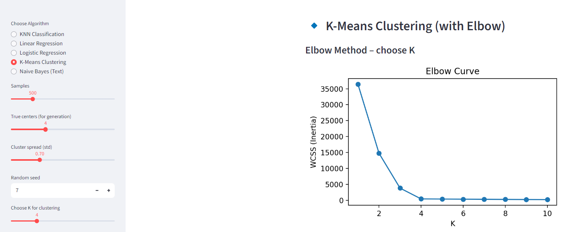
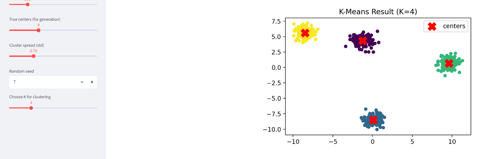
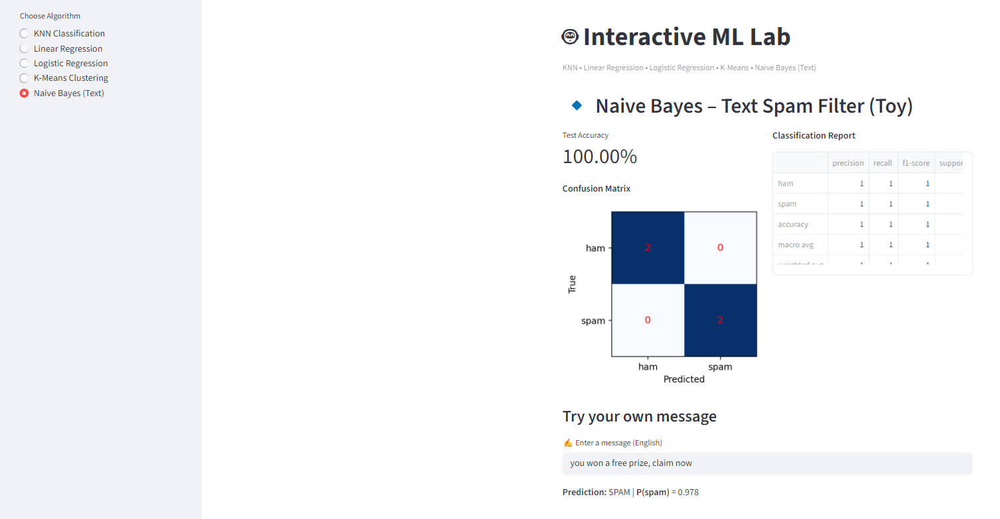

# 🤖 ML_Project_221902243 – Interactive ML Lab  

An interactive **Streamlit-based Machine Learning Lab** project that demonstrates fundamental ML algorithms with clear visualizations.  
This project was developed as part of my **Machine Learning Lab course** to make algorithms easy to understand and test in real-time.  

---

## 🔹 Features  
This app covers **five core ML algorithms**:  

- 📌 **K-Nearest Neighbors (KNN)** – classification on the Iris dataset with accuracy & confusion matrix  
- 📌 **Linear Regression** – predicting scores from hours studied (synthetic data)  
- 📌 **Logistic Regression** – binary classification (pass/fail) with ROC curve & decision curve  
- 📌 **K-Means Clustering** – clustering with Elbow method for selecting K  
- 📌 **Naive Bayes (Text Classification)** – spam vs. ham toy message filter  

---

## 📸 Screenshots  

### 🔹 KNN Classification (Confusion Matrix)  
  

### 🔹 Linear Regression (Best Fit Line)  
  

### 🔹 Logistic Regression  
**ROC Curve**  
  

**Decision Curve**  
  

### 🔹 K-Means Clustering  
**Elbow Method**  
  

**Cluster Visualization**  
  

### 🔹 Naive Bayes (Spam Filter)  
  

---

## 🚀 How to Run  

1️⃣ Clone the Repository
git clone https://github.com/your-username/ML_Project_221902243.git
cd ML_Project_221902243

2️⃣ Install Dependencies
pip install -r requirements.txt

3️⃣ Run the App
streamlit run ml_lab.py

📦 Requirements
streamlit – interactive web app

numpy & pandas – data handling

matplotlib – plotting

scikit-learn – ML models

✍️ Author
👩 Kakoli Akter
📧 kakoli080501@gmail.com

